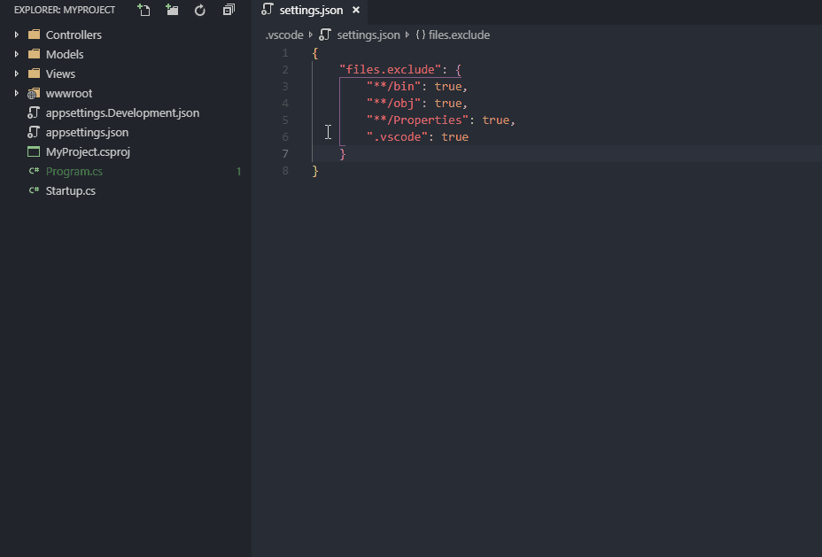

# Dotfile Toggle

English | [简体中文](README.zh-CN.md)

Toggle the visibility of entries excluded by VS Code's `files.exclude` setting. In Simplified Chinese, the extension is displayed as **点文件显示开关**.

## Features

The following commands are available from the Command Palette under the **Dotfile Toggle** category:

- `Hide Dotfiles`
- `Show Dotfiles`
- `Toggle Dotfiles`

`Toggle Dotfiles` is also available from the Explorer context menu.

In a Simplified Chinese VS Code window, the Command Palette can show the localized title together with its English alias, for example:

```text
点文件显示开关: 显示点文件
Dotfile Toggle: Show Dotfiles
```

Both Chinese and English text can therefore be used to search for the commands.

## Scope

Despite the extension name and the Chinese product term “点文件”, the extension operates on boolean entries in VS Code's `files.exclude` setting. It can affect any matching excluded file or folder, not only names beginning with a dot.

The extension checks these configuration scopes:

- User settings;
- Workspace settings;
- Workspace-folder settings in multi-root workspaces.

## Known limitations

Only exclusion entries whose values are booleans are toggled. Conditional exclusion objects are left unchanged.

For example, the following entries are supported:

```json
{
  "files.exclude": {
    "**/.git": true,
    "**/.DS_Store": true
  }
}
```

## Always-visible dotfiles

Use `dotfileToggle.keepVisible` to name dotfiles or dotfolders that must remain visible when the other dotfiles are hidden. Enter only the name, not a `files.exclude` key:

```json
{
  "files.exclude": {
    "**/.*": true
  },
  "dotfileToggle.keepVisible": [
    ".env",
    ".vscode"
  ]
}
```

This works with the common `"**/.*"` catch-all rule. When hiding, Dotfile Toggle automatically replaces that broad rule with an equivalent generated exclusion rule that skips the names you listed. Therefore `.env` and `.vscode` remain visible without requiring you to manually split or maintain glob patterns. When showing, the generated rule is removed again.

You may also use the older `"**/.env"` form; it remains supported for compatibility. The setting accepts simple dotfile names only, so it intentionally does not support arbitrary glob expressions. It can be configured at user, workspace, or workspace-folder scope.

Only boolean `files.exclude` entries are changed. Conditional exclusion objects are left unchanged. If you edit `files.exclude` manually while dotfiles are hidden, first run **Show Dotfiles** to remove the temporary generated rule.

## Installation and migration

The independent Marketplace extension identifier is planned as:

```text
henrychang.dotfile-toggle
```

After the extension has been published, install that identifier from the Extensions view or with:

```bash
code --install-extension henrychang.dotfile-toggle
```

The earlier private VSIX used the upstream identifier `adrianwilczynski.toggle-hidden`. Because changing the publisher changes the extension identifier, Settings Sync cannot be expected to migrate the private build automatically. Install and verify the Marketplace version first, then remove the private/upstream-identifier build if it is still installed.

## Settings Sync

Once the extension is available from Visual Studio Marketplace, VS Code Settings Sync can restore it on another machine by its Marketplace identifier. User-level `files.exclude` values are handled by VS Code's settings synchronization; workspace-level values should remain in the workspace configuration or project repository.

`dotfileToggle.keepVisible` is a normal VS Code setting: user-level values can be synchronized by Settings Sync, while workspace-level values should remain in the workspace configuration. On VS Code versions that support it, the extension also synchronizes the internal key needed to clean up a temporary global exclusion rule on another machine.

## Local build

```bash
npm install
npm run compile
npx @vscode/vsce package --out temp/dotfile-toggle-1.2.1.vsix
```

The project intentionally does not add automated test, packaging, or publishing scripts. Release packages are built and inspected manually.

## Presentation



## Project history

This project is independently maintained from [Adrian Wilczyński's Peek Hidden Files](https://github.com/AdrianWilczynski/PeekHiddenFiles). It retains the original command identifiers and core behavior while adding manifest localization, Simplified Chinese documentation, and build maintenance.

## License

MIT. See [LICENSE](LICENSE). The original copyright notice is retained.
